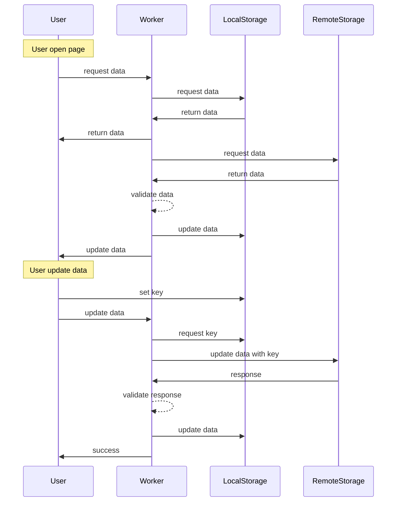

```mermaid
sequenceDiagram
    participant U as User
    participant W as Worker
    participant LS as LocalStorage
    participant RS as RemoteStorage

    Note over U: User open page
    U->>W: request data
    W->>LS: request data
    LS->>W: return data
    W->>U: return data

    W->>RS: request data
    RS->>W: return data
    W-->>W: validate data
    W->>LS: update data
    W->>U: update data

    Note over U: User update data
    U->>LS: set key
    U->>W: update data
    W->>LS: request key
    W->>RS: update data with key
    RS->>W: response
    W-->>W: validate response
    W->>LS: update data
    W->>U: success

```
