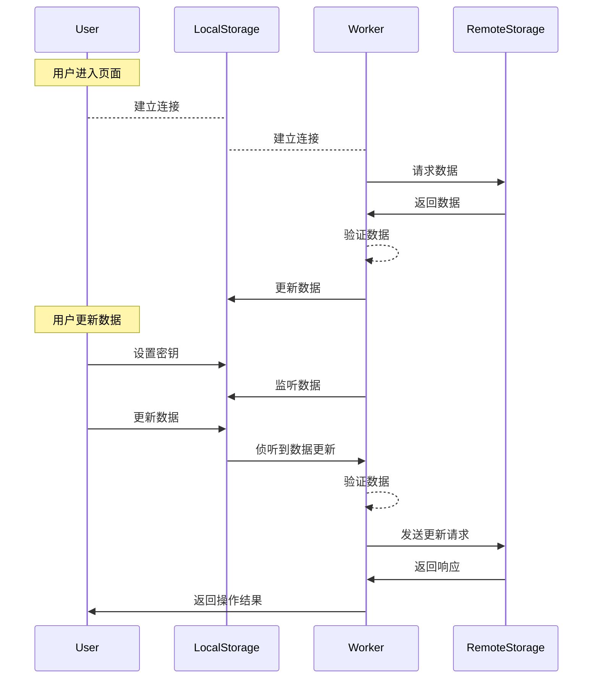

```mermaid
sequenceDiagram
    participant U as User
    participant LS as LocalStorage
    participant W as Worker
    participant RS as RemoteStorage

    Note over U: 用户进入页面
    U-->LS: 建立连接
    W-->LS: 建立连接

    W->>RS: 请求数据
    RS->>W: 返回数据
    W-->>W: 验证数据
    W->>LS: 更新数据

    Note over U: 用户更新数据
    U->>LS: 设置密钥
    W->>LS: 监听数据

    U->>LS: 更新数据
    LS->>W: 侦听到数据更新
    W-->>W: 验证数据
    W->>RS: 发送更新请求
    RS->>W: 返回响应
    W->>U: 返回操作结果
```
